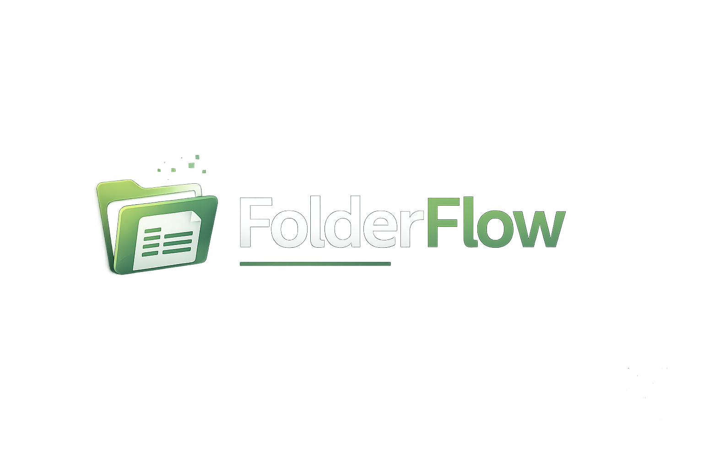

# 📦 FolderFlow Pro

<p align="center">



# Automatize tarefas em poucos cliques

**Gerador de Pastas • Gerador de Excel • Conversor PNG para ICO**

</p>

---

## 📖 Sobre

O **FolderFlow Pro** é uma suíte de automação desenvolvida em Python para eliminar tarefas repetitivas do dia a dia.

Com uma interface moderna e intuitiva, o sistema permite criar estruturas completas de pastas, gerar planilhas Excel personalizadas e converter imagens em ícones profissionais, tudo em uma única aplicação.

Ideal para empresas, escritórios, departamentos administrativos, estudantes e desenvolvedores.

---

# ✨ Recursos

## 📁 Gerador de Pastas

Crie centenas de pastas automaticamente.

### Recursos

- Criar pastas ilimitadas
- Criar subpastas automaticamente
- Pasta principal personalizada
- Estrutura hierárquica
- Interface Dark Mode
- Seleção da pasta de destino

---

## 📊 Gerador de Excel

Crie planilhas profissionais sem abrir o Microsoft Excel.

### Recursos

- Quantidade personalizada de linhas
- Quantidade personalizada de colunas
- Ajuste automático das colunas
- Bordas automáticas
- Cabeçalhos personalizados
- Exportação em XLSX

---

## 🖼 Conversor PNG para ICO

Converta imagens em ícones para programas.

### Recursos

- PNG
- JPG
- JPEG

Exportação rápida para:

- ICO 16x16
- ICO 32x32
- ICO 48x48
- ICO 64x64
- ICO 128x128
- ICO 256x256

---

# 🖥 Interface

O sistema possui uma interface gráfica moderna desenvolvida em Tkinter.

✔ Tema escuro

✔ Botões personalizados

✔ Logo personalizada

✔ Ícone do programa

✔ Janelas centralizadas

✔ Fácil utilização

---

# 📂 Estrutura

```
FolderFlow-Pro/

│

├── FolderFlow.py

│

├── assets/

│   ├── logo.ico

│   ├── logo.png

│   └── banner.png

│

├── modules/

│   ├── gerador_pastas.py

│   ├── gerador_excel.py

│   └── conversor_ico.py

│ Manual.pdf

│  Licenca.txt

│ Termo_de_Uso.txt

│

├── requirements.txt

└── README.md
```

---

# 🚀 Instalação

Clone o projeto

```bash
git clone https://github.com/SEU-USUARIO/FolderFlow-Pro.git
```

Entre na pasta

```bash
cd FolderFlow-Pro
```

Instale as dependências

```bash
pip install -r requirements.txt
```

---

# ▶ Executando

Abra o menu principal

```bash
python FolderFlow.py
```

Ou execute diretamente os módulos

```bash
python modules/gerador_pastas.py
```

```bash
python modules/gerador_excel.py
```

```bash
python modules/conversor_ico.py
```

---

# 📦 Gerar Executável

Com PyInstaller

```bash
pyinstaller FolderFlow.spec
```

Será criado

```
dist/

FolderFlow.exe
```

---

# 🛠 Tecnologias

- Python
- Tkinter
- Pillow
- OpenPyXL
- PyInstaller

---

# 💼 Público-Alvo

- Empresas
- Escritórios
- Recursos Humanos
- Frotas
- Administração
- Contabilidade
- Engenharia
- Desenvolvedores
- Estudantes

---

# ⭐ Diferenciais

- Interface profissional
- Código organizado
- Fácil manutenção
- Totalmente offline
- Sem necessidade de internet
- Alto desempenho
- Baixo consumo de memória
- Fácil distribuição

---

# 🔒 Licença

Este projeto possui licença de uso.

Consulte:

- Licença
- Manual
- Termo de Uso

localizados na pasta **docs**.

---

# 👩‍💻 Desenvolvido por

**Rafaela Sommer Gonçalves**

Engenharia da Computação

Python • Automação • Excel • Interfaces Gráficas

---

<p align="center">

### ⭐ Se este projeto foi útil para você, deixe uma estrela no repositório.

### 🚀 FolderFlow Pro — Automatizando tarefas, aumentando a produtividade.

</p>